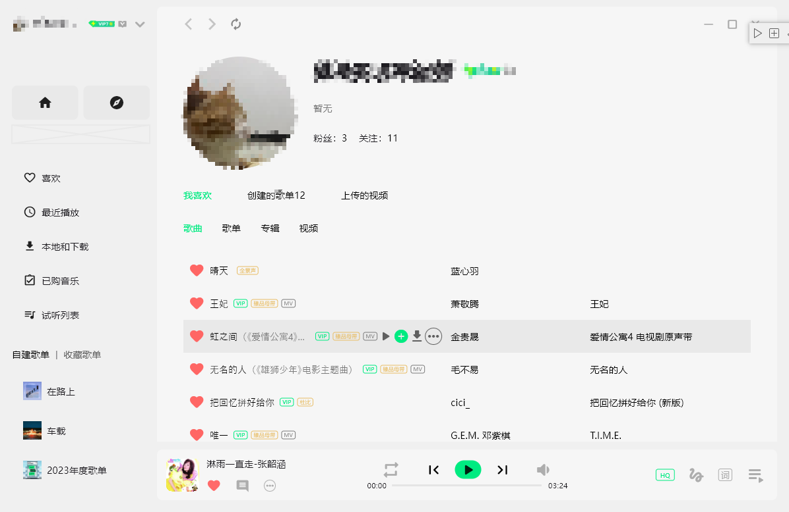

# qqmusic

A new Flutter project.



## Getting Started

This project is a starting point for a Flutter application.

A few resources to get you started if this is your first Flutter project:

- [Lab: Write your first Flutter app](https://docs.flutter.dev/get-started/codelab)
- [Cookbook: Useful Flutter samples](https://docs.flutter.dev/cookbook)

For help getting started with Flutter development, view the
[online documentation](https://docs.flutter.dev/), which offers tutorials,
samples, guidance on mobile development, and a full API reference.

## 🎵

仿照qq音乐桌面端来开发，flutter练手项目。

- [ ] 完成基本页面开发
- [ ] 接入 api 
- [ ] 实现精简模式

## g_tk 获取

```typescript
function g_tk(e?: boolean) {
  let n = 5381;
  const t = "Q_H_L_63k3NYJlKiYEpcUG_gK-W2I_R6vCvCm3Zs2x-AgrMB64VVFugfg_PVkzngJhtCFwAPy2EDY5WyO9bLrxmkGUza_w"
  // if (t = e ? l("qqmusic_key") || l("p_skey") || l("skey") || l("p_lskey") || l("lskey") : l("skey") || l("qqmusic_key"))
  for (var r = 0, i = t.length; r < i; ++r)
    n += (n << 5) + t.charCodeAt(r);
  return 2147483647 & n
}
```

```javascript
{
  ct: 24,
  cv: 4747474,
  format: "json",
  g_tk: 1728741421,
  g_tk_new_20200303: 1728741421,
  inCharset: "utf-8",
  needNewCode: 1,
  notice: 0,
  outCharset: "utf-8",
  platform: "yqq.json",
  uin: 1836017030,
}
```

```json
{\"comm\":{\"cv\":4747474,\"ct\":24,\"format\":\"json\",\"inCharset\":\"utf-8\",\"outCharset\":\"utf-8\",\"notice\":0,\"platform\":\"yqq.json\",\"needNewCode\":1,\"uin\":1836017030,\"g_tk_new_20200303\":1728741421,\"g_tk\":1728741421},\"req_1\":{\"module\":\"music.musicasset.PlaylistFavWrite\",\"method\":\"CancelFavPlaylist\",\"param\":{\"uin\":\"1836017030\",\"v_playlistId\":[8748213570]}}}
```

```javascript
{
  comm: {
    cv: 4747474,
    ct: 24,
    format: 'json',
    inCharset: 'utf-8',
    outCharset: 'utf-8',
    notice: 0,
    platform: 'yqq.json',
    needNewCode: 1,
    uin: 1836017030,
    g_tk_new_20200303: 1728741421,
    g_tk: 1728741421,
  },
  req_1: {
    module: 'music.musicasset.PlaylistFavWrite',
    method: 'FavPlaylist or CancelFavPlaylist',
    param: {
      uin: '1836017030',
      v_playlistId: [
        8748213570,
      ],
    },
  },
}
```

## zzc加密

[对抗 QQ 音乐网页端的请求签名 (zzc + ag-1)](https://jixun.uk/posts/2024/qqmusic-zzc-sign/)

GitHub: [jixunmoe/qmweb-sign](https://github.com/jixunmoe/qmweb-sign)

## 音乐品质

- size_new[0] = 臻品母带
- size_new[1] = 臻品全景声
- size_new[2] = 臻品音质
- size_dolby = 杜比
- size_flac = SQ
- size_320mp3 = HQ
- size_128mp3 = 标准
